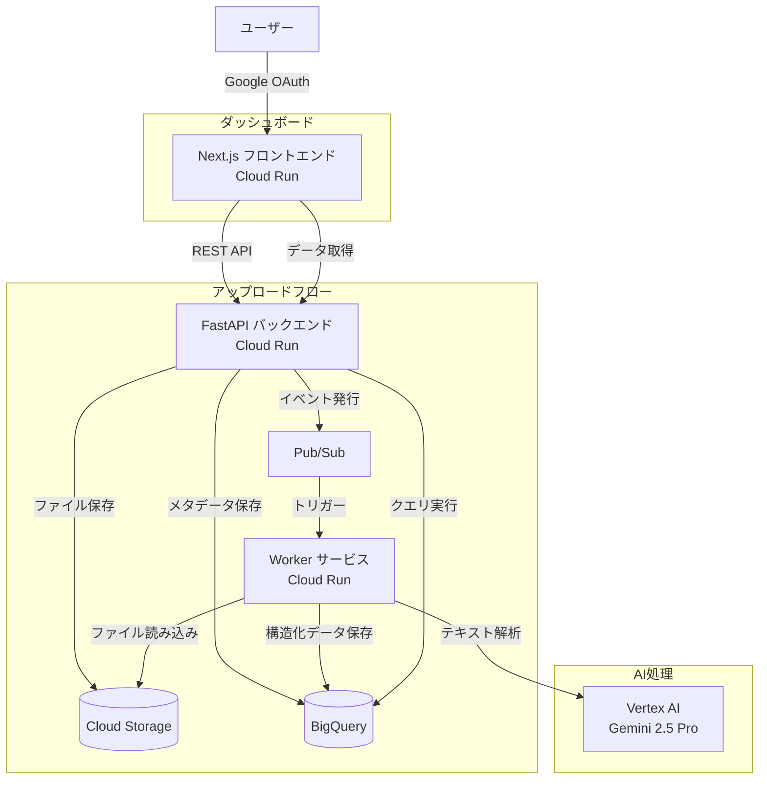
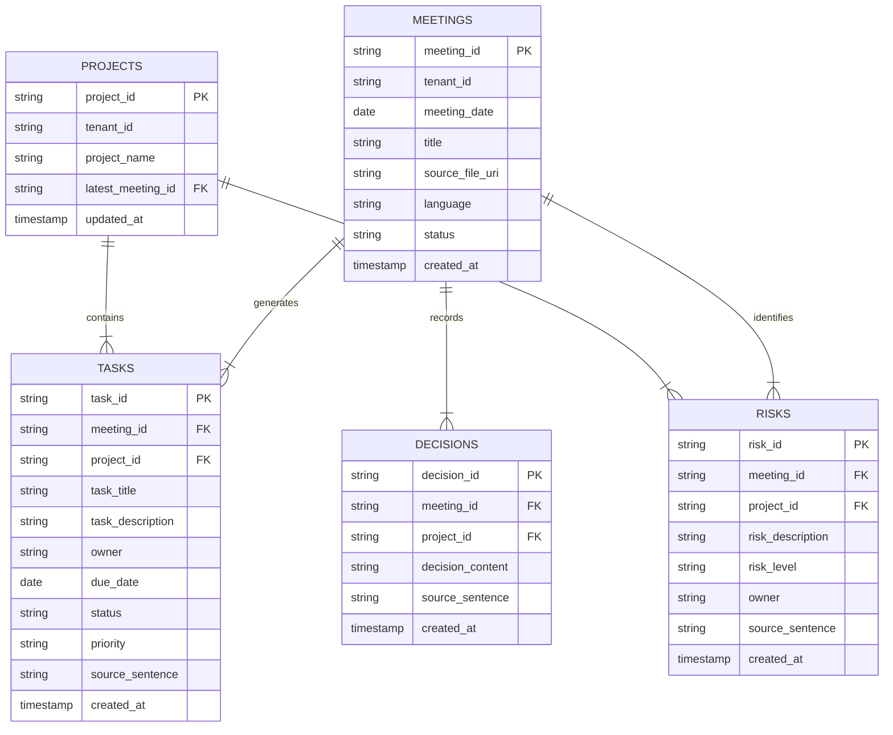

# Project Progress DB & Risk Dashboard

AI会議議事録解析・プロジェクト進捗管理システム

## 概要

このプロジェクトは、**Google Vertex AI (Gemini)** を活用して会議議事録から**プロジェクト情報・タスク・リスク・決定事項**を自動抽出し、ダッシュボードで可視化するフルスタックWebアプリケーションです。

プロジェクトマネージャー（PM）、プロダクトマネージャー（PdM）、PMO、マネージャー層向けに設計されており、会議後の手作業による記録作成を大幅に削減し、プロジェクトの健全性を一目で把握できます。

### デプロイ先

本番環境のURLは Cloud Run によって自動生成されます。以下のコマンドで確認できます：

```bash
# Frontend URL
gcloud run services describe project-progress-frontend-prod --region=asia-northeast1 --format='value(status.url)'

# API URL
gcloud run services describe project-progress-api-prod --region=asia-northeast1 --format='value(status.url)'
```

> **重要**: フロントエンドをデプロイする際は、必ずAPI URLを動的に取得して `NEXT_PUBLIC_API_URL` 環境変数に設定してください。Cloud Build の `cloudbuild.yaml` はこれを自動的に行います。

---

## ユーザーが利用できるサービス・機能

### 1. 会議議事録のアップロード・AI解析
- **多様な入力形式に対応**:
  - `.txt`, `.md` - プレーンテキスト/Markdownファイル
  - `.vtt` - WebVTT形式（Zoom, YouTube, Google Meet字幕）
  - `.srt` - SubRip形式（標準字幕）
  - **Otter.ai** - エクスポートしたテキストファイル
  - **tl;dv** - エクスポートしたテキスト/Markdown
  - **Zoom** - 文字起こしテキストファイル
- **会議メタ情報の入力**: 会議日、タイトル（任意）を設定
- **自動形式検出**: アップロードされたファイルの形式を自動判別
- **AIによる自動構造化**: アップロード後、Gemini AIが以下を自動抽出:
  - **プロジェクト**: 議事録内で言及されているプロジェクトを識別
  - **タスク**: アクションアイテム（担当者、期限、優先度、ステータス付き）
  - **リスク**: 明示的なリスクおよび「リスクっぽい発言」（例: 「心配している」「厳しいかもしれない」）
  - **決定事項**: 会議で合意された内容

### 2. プロジェクト進捗ダッシュボード
- **プロジェクト一覧表示**: 抽出されたプロジェクトをカード形式で一覧表示
- **タスク一覧表示**: プロジェクトごと、または全体のタスクを表で表示
- **フィルタリング機能**: プロジェクト選択によるタスクの絞り込み
- **ステータス・優先度の可視化**: 色分けされたバッジで直感的に把握

### 3. リスクダッシュボード
- **リスク統計サマリー**: 総リスク数、レベル別（高・中・低）の件数を表示
- **リスク一覧表示**: カード形式で詳細表示
- **多軸フィルタリング**: プロジェクト、リスクレベル、テキスト検索で絞り込み
- **原文引用表示**: AIが抽出した元の発言テキストを確認可能

### 4. データエクスポート
- **CSV形式でダウンロード**: プロジェクト、タスク、リスク、決定事項をそれぞれCSVでエクスポート
- **フィルタ適用エクスポート**: 現在のフィルタ条件を反映したデータをエクスポート

### 5. 認証・セキュリティ
- **Google OAuth認証**: Googleアカウントによるシングルサインオン
- **セッション管理**: JWTベースの認証トークン管理
- **ドメイン制限**: 許可されたドメインのユーザーのみアクセス可能（オプション）

---

## アーキテクチャ



### 処理フロー

1. **アップロード**
   - ユーザーがフロントエンドから議事録ファイルをアップロード
   - APIがファイルをCloud Storageに保存
   - メタデータをBigQueryの`meetings`テーブルに登録（ステータス: PENDING）
   - Pub/Subに処理リクエストを発行

2. **非同期AI処理（Worker）**
   - Pub/Subからのメッセージを受信
   - Cloud Storageからファイルを読み込み
   - Vertex AI (Gemini) でテキスト解析・構造化
   - 抽出データをBigQueryに保存
   - ミーティングステータスをDONEに更新

3. **ダッシュボード表示**
   - フロントエンドがAPIを通じてBigQueryからデータを取得
   - リアルタイムでプロジェクト・タスク・リスクを可視化

---

## 技術スタック

### フロントエンド
| カテゴリ | 技術 |
|---------|------|
| フレームワーク | **Next.js 15** (App Router) |
| 言語 | **TypeScript 5** |
| UI/スタイリング | **Tailwind CSS 3.4** |
| ランタイム | **React 19** (RC版) |
| HTTP | **Fetch API** (credentials: include) |
| 状態管理 | React Hooks (useState, useEffect) |

### バックエンド
| カテゴリ | 技術 |
|---------|------|
| APIフレームワーク | **FastAPI** (Python) |
| Workerフレームワーク | **Flask** (Pub/Subハンドラ) |
| 認証 | **Google OAuth 2.0**, **JWT** (python-jose) |
| 日付解析 | **dateparser**, **python-dateutil** |
| テスト | **pytest**, **httpx** |

### インフラ（Google Cloud Platform）
| サービス | 用途 |
|----------|------|
| **Cloud Run** | フロントエンド、API、Workerのホスティング |
| **Cloud Storage** | 議事録ファイルの保存 |
| **BigQuery** | 構造化データの保存・クエリ |
| **Pub/Sub** | 非同期処理のメッセージキュー |
| **Vertex AI** | Gemini 2.5 Pro による自然言語処理 |
| **Secret Manager** | OAuthクレデンシャル管理 |

### IaC・CI/CD
| ツール | 用途 |
|--------|------|
| **Terraform** | インフラのコード化 |
| **Cloud Build** | CI/CDパイプライン |

---

## AI活用（Vertex AI Gemini）

### 使用モデル
- **Gemini 2.5 Pro** (`gemini-2.5-pro`)

### AI処理の詳細

#### プロンプト設計
AIはプロジェクト管理アシスタントとして振る舞い、以下を抽出:

```
1. Projects: 議論されているプロジェクトの識別
2. Tasks: アクションアイテムの抽出（ステータス・優先度を推論）
3. Risks: 明示的リスク + "リスクっぽい発言"の抽出
   - 例: 「心配している」「厳しいかも」「不確実」
   - 元の発言をsource_sentenceとして保持
   - コンテキストからリスクレベル（LOW/MEDIUM/HIGH）を判定
4. Decisions: 合意・決定事項の抽出
```

#### JSON Schema制約
レスポンスは厳密なJSON Schemaに従って構造化:
- `response_mime_type: "application/json"`
- `response_schema: <定義済みスキーマ>`

#### 自然言語日付解析
- 「来週金曜」「12月2日」などの表現を会議日を基準に絶対日付に変換
- `dateparser`ライブラリで多言語対応

---

## データ構造（BigQueryスキーマ）

### ER図



### テーブル定義

#### meetings（会議）
| カラム | 型 | 説明 |
|--------|-----|------|
| meeting_id | STRING | 主キー (UUID) |
| tenant_id | STRING | テナント識別子 |
| meeting_date | DATE | 会議日 |
| title | STRING | 会議タイトル |
| source_file_uri | STRING | GCS URI |
| language | STRING | 言語コード (ja等) |
| status | STRING | PENDING / DONE / ERROR |
| created_at | TIMESTAMP | 作成日時 |

#### projects（プロジェクト）
| カラム | 型 | 説明 |
|--------|-----|------|
| project_id | STRING | 主キー (UUID) |
| tenant_id | STRING | テナント識別子 |
| project_name | STRING | プロジェクト名 |
| latest_meeting_id | STRING | 最新会議ID |
| updated_at | TIMESTAMP | 更新日時 |

#### tasks（タスク）
| カラム | 型 | 説明 |
|--------|-----|------|
| task_id | STRING | 主キー (UUID) |
| meeting_id | STRING | 会議ID |
| project_id | STRING | プロジェクトID |
| task_title | STRING | タスク名 |
| task_description | STRING | 詳細説明 |
| owner | STRING | 担当者 |
| due_date | DATE | 期限 |
| status | STRING | NOT_STARTED / IN_PROGRESS / DONE |
| priority | STRING | LOW / MEDIUM / HIGH |
| source_sentence | STRING | 元の発言 |

#### risks（リスク）
| カラム | 型 | 説明 |
|--------|-----|------|
| risk_id | STRING | 主キー (UUID) |
| meeting_id | STRING | 会議ID |
| project_id | STRING | プロジェクトID |
| risk_description | STRING | リスク説明 |
| risk_level | STRING | LOW / MEDIUM / HIGH |
| owner | STRING | 担当者 |
| source_sentence | STRING | 元の発言 |

---

## UIコンポーネント

### フロントエンドコンポーネント構成

```
frontend/
├── app/
│   ├── layout.tsx          # ルートレイアウト
│   ├── page.tsx            # メインダッシュボード
│   ├── login/page.tsx      # ログインページ
│   ├── upload/page.tsx     # アップロードページ
│   └── risks/page.tsx      # リスクダッシュボード
├── components/
│   ├── Dashboard.tsx       # メインダッシュボード
│   ├── ProjectList.tsx     # プロジェクト一覧
│   ├── TaskList.tsx        # タスク一覧テーブル
│   ├── RiskList.tsx        # リスクカードリスト
│   ├── RiskFilters.tsx     # リスクフィルタUI
│   ├── UploadForm.tsx      # ファイルアップロードフォーム
│   ├── ExportButton.tsx    # CSVエクスポートボタン
│   ├── UserMenu.tsx        # ユーザーメニュー
│   ├── AuthGuard.tsx       # 認証ガード
│   ├── LoadingSpinner.tsx  # ローディング表示
│   ├── Toast.tsx           # 通知トースト
│   ├── ToastContainer.tsx  # トーストコンテナ
│   └── ErrorBoundary.tsx   # エラーバウンダリ
└── lib/
    ├── api.ts              # API通信関数
    ├── auth.ts             # 認証ユーティリティ
    └── toast.ts            # トースト通知
```

### デザインシステム
- **Glassmorphism**: 半透明ガラス効果のカード (`glass` クラス)
- **グラデーション**: タイトルにグラデーションテキスト
- **カラーバッジ**: ステータス・優先度・リスクレベルを色分け表示
  - HIGH: 赤 (`bg-red-500/20 text-red-400`)
  - MEDIUM: 黄 (`bg-yellow-500/20 text-yellow-400`)
  - LOW: 緑 (`bg-green-500/20 text-green-400`)
- **ダークテーマ**: 背景は暗めのグラデーション

---

## API エンドポイント

### 認証
| メソッド | パス | 説明 |
|----------|------|------|
| GET | `/auth/login` | Google OAuth認証開始 |
| GET | `/auth/callback` | OAuthコールバック |
| GET | `/auth/me` | 現在のユーザー情報 |
| POST | `/auth/logout` | ログアウト |

### アップロード
| メソッド | パス | 説明 |
|----------|------|------|
| POST | `/upload/` | 議事録ファイルアップロード |

### プロジェクト
| メソッド | パス | 説明 |
|----------|------|------|
| GET | `/projects/` | プロジェクト一覧取得 |

### タスク
| メソッド | パス | 説明 |
|----------|------|------|
| GET | `/tasks/` | タスク一覧取得 |
| GET | `/tasks/?project_id=xxx` | プロジェクト別タスク |

### リスク
| メソッド | パス | 説明 |
|----------|------|------|
| GET | `/risks/` | リスク一覧取得 |
| GET | `/risks/stats` | リスク統計 |
| GET | `/risks/decisions` | 決定事項一覧 |

### エクスポート
| メソッド | パス | 説明 |
|----------|------|------|
| GET | `/export/projects` | プロジェクトCSV |
| GET | `/export/tasks` | タスクCSV |
| GET | `/export/risks` | リスクCSV |
| GET | `/export/decisions` | 決定事項CSV |

---

## セットアップ

### 前提条件
- Google Cloud プロジェクト（課金有効）
- `gcloud` CLI インストール・認証済み
- Python 3.11以上
- Node.js 18以上
- Terraform（本番デプロイ時）

### ローカル開発

#### 1. バックエンドAPI
```bash
cd backend/api
python -m venv venv
source venv/bin/activate
pip install -r requirements.txt

# 環境変数設定 (.env.example参照)
cp .env.example .env
# .envを編集

uvicorn main:app --reload --port 8000
```

#### 2. フロントエンド
```bash
cd frontend
npm install

# 環境変数設定
cp .env.example .env.local
# .env.localを編集

npm run dev
```

### 本番デプロイ

#### 1. Terraform でインフラを構築（初回のみ）

```bash
cd terraform
terraform init
terraform apply
```

#### 2. gcloud CLI からアプリケーションをデプロイ（推奨フロー）

Terraform で Artifact Registry / Cloud Run / IAM などが作成済みであることを前提に、  
アプリケーションの更新は **gcloud CLI からのビルド＆デプロイ** で行います。

事前に以下を満たしていること:

- `gcloud auth login` 済み
- `gcloud config set project sandbox-471809` 済み（または各コマンドの `--project` で指定）
- Vertex AI / Cloud Run / Artifact Registry / BigQuery / Pub/Sub などの API が有効

##### 2-1. 使用するサービスアカウント

Terraform 実行済み環境では、以下のサービスアカウントが作成されています（`iam.tf` 参照）。

- **API 用 SA**: `api-sa-8fd82014@sandbox-471809.iam.gserviceaccount.com`
- **Worker 用 SA**: `worker-sa-8fd82014@sandbox-471809.iam.gserviceaccount.com`
- **Pub/Sub Push 用 SA**: `pubsub-invoker-8fd82014@sandbox-471809.iam.gserviceaccount.com`

類似名のサービスアカウントが存在する可能性があるため、実際には次のコマンドで確認してください:

```bash
gcloud iam service-accounts list --project sandbox-471809
```

##### 2-2. コンテナイメージのビルド＆push

Artifact Registry リポジトリ: `asia-northeast1-docker.pkg.dev/sandbox-471809/project-progress-db`

```bash
cd /Users/hayatokumemura/Desktop/Projects/Other/struct-project

# API イメージ
gcloud builds submit backend/api \
  --project sandbox-471809 \
  --tag asia-northeast1-docker.pkg.dev/sandbox-471809/project-progress-db/api:prod-latest

# Worker イメージ
gcloud builds submit backend/worker \
  --project sandbox-471809 \
  --tag asia-northeast1-docker.pkg.dev/sandbox-471809/project-progress-db/worker:prod-latest

# Frontend イメージ（Dockerfile 内のデフォルト API URL を使用）
gcloud builds submit frontend \
  --project sandbox-471809 \
  --tag asia-northeast1-docker.pkg.dev/sandbox-471809/project-progress-db/frontend:prod-latest
```

##### 2-3. Cloud Run API サービスのデプロイ

サービス名: `project-progress-api-prod`

```bash
# 1. まずFrontend URLを取得（既にデプロイ済みの場合）または後で設定
FRONTEND_URL=$(gcloud run services describe project-progress-frontend-prod --region=asia-northeast1 --format='value(status.url)' 2>/dev/null || echo "https://placeholder.run.app")

# 2. API をデプロイ
gcloud run deploy project-progress-api-prod \
  --project sandbox-471809 \
  --region asia-northeast1 \
  --image asia-northeast1-docker.pkg.dev/sandbox-471809/project-progress-db/api:prod-latest \
  --platform=managed \
  --service-account=api-sa-8fd82014@sandbox-471809.iam.gserviceaccount.com \
  --allow-unauthenticated \
  --cpu=1 --memory=512Mi --min-instances=1 --max-instances=10 --concurrency=80 --timeout=60s \
  --update-env-vars=PROJECT_ID=sandbox-471809,BIGQUERY_DATASET=project_progress_db,PUBSUB_TOPIC=upload-events,ENVIRONMENT=prod,FRONTEND_URL=$FRONTEND_URL,ALLOWED_OAUTH_DOMAINS=datafluct.com,GCS_BUCKET=sandbox-471809-meeting-notes-raw \
  --set-secrets=OAUTH_CLIENT_ID=oauth-client-id:latest,OAUTH_CLIENT_SECRET=oauth-client-secret:latest,JWT_SECRET_KEY=jwt-secret-key:latest
```

##### 2-4. Cloud Run Worker サービスのデプロイ

サービス名: `project-progress-worker-prod`

```bash
gcloud run deploy project-progress-worker-prod \
  --project sandbox-471809 \
  --region asia-northeast1 \
  --image asia-northeast1-docker.pkg.dev/sandbox-471809/project-progress-db/worker:prod-latest \
  --platform=managed \
  --service-account=worker-sa-8fd82014@sandbox-471809.iam.gserviceaccount.com \
  --no-allow-unauthenticated \
  --cpu=2 --memory=1Gi --min-instances=0 --max-instances=10 --timeout=300s \
  --update-env-vars=PROJECT_ID=sandbox-471809,BIGQUERY_DATASET=project_progress_db,REGION=asia-northeast1,ENVIRONMENT=prod,GEMINI_LOCATION=us-central1,GEMINI_MODEL=gemini-2.5-pro
```

- `GEMINI_LOCATION` / `GEMINI_MODEL` は Vertex AI Gemini の利用リージョン・モデル名に合わせて調整してください  
  （初回利用時は GCP コンソールから利用規約への同意が必要です）。

##### 2-5. Cloud Run Frontend サービスのデプロイ

サービス名: `project-progress-frontend-prod`

> **重要**: フロントエンドは必ずAPI URLを `NEXT_PUBLIC_API_URL` 環境変数に設定してデプロイしてください。

```bash
# 1. API URLを取得
API_URL=$(gcloud run services describe project-progress-api-prod --region=asia-northeast1 --format='value(status.url)')
echo "Using API URL: $API_URL"

# 2. Frontend をデプロイ（API URLを環境変数として設定）
gcloud run deploy project-progress-frontend-prod \
  --project sandbox-471809 \
  --region asia-northeast1 \
  --image asia-northeast1-docker.pkg.dev/sandbox-471809/project-progress-db/frontend:prod-latest \
  --platform=managed \
  --allow-unauthenticated \
  --cpu=1 --memory=512Mi --min-instances=1 --max-instances=10 --timeout=60s \
  --set-env-vars=NEXT_PUBLIC_API_URL=$API_URL
```

これらのコマンドを実行することで、**API / Worker / Frontend の本番リビジョンがすべて gcloud 経由で非対話的に更新**されます。

> **注意**: `NEXT_PUBLIC_API_URL` を設定し忘れると、フロントエンドが古いAPI URLを参照してログインエラーになる可能性があります。

### OAuth認証設定（本番環境）

1. **Google Cloud Console**で「OAuth クライアント ID」を作成（ウェブアプリケーション）
2. **承認済みリダイレクトURI**を設定:
   ```
   https://[API_SERVICE_URL]/auth/callback
   ```
3. Secret Managerに登録:
   ```bash
   printf "YOUR_CLIENT_ID" | gcloud secrets versions add oauth-client-id --data-file=-
   printf "YOUR_CLIENT_SECRET" | gcloud secrets versions add oauth-client-secret --data-file=-
   ```

---

## 使い方

### 1. ログイン
- トップページで「Googleでログイン」をクリック
- Googleアカウントで認証

### 2. 議事録のアップロード
1. 「議事録アップロード」ボタンをクリック
2. 会議日を選択
3. タイトルを入力（任意）
4. `.txt`または`.md`ファイルを選択
5. 「議事録をアップロード」をクリック
6. AI解析が自動で開始（通常1分以内に完了）

### 3. ダッシュボードの確認
- プロジェクト一覧から対象を選択
- 関連タスクが右側に表示
- エクスポートボタンでCSVダウンロード

### 4. リスクの確認
1. 「リスクダッシュボード」をクリック
2. 統計サマリーでリスク状況を把握
3. フィルタで絞り込み
4. 各リスクの元発言を確認

---

## テスト

### E2Eテスト
```bash
python3 e2e_test.py
```

### ユニットテスト
```bash
cd backend/api
pytest
```

---

## 今後の拡張予定（Future）

- Google Docs / Google Drive連携
- Google Meet / Zoom 文字起こし連携
- カレンダーからの会議情報自動取得
- 会議間の差分検出（新規タスク、ステータス変更、エスカレーションされたリスク）
- プロジェクトヘルススコア
- Slack / Chat通知
- 次回会議アジェンダ自動生成
- ロール＆パーミッション（Admin, PM, Member）
- 監査ログ

---

## ライセンス

このプロジェクトはプライベートリポジトリです。
