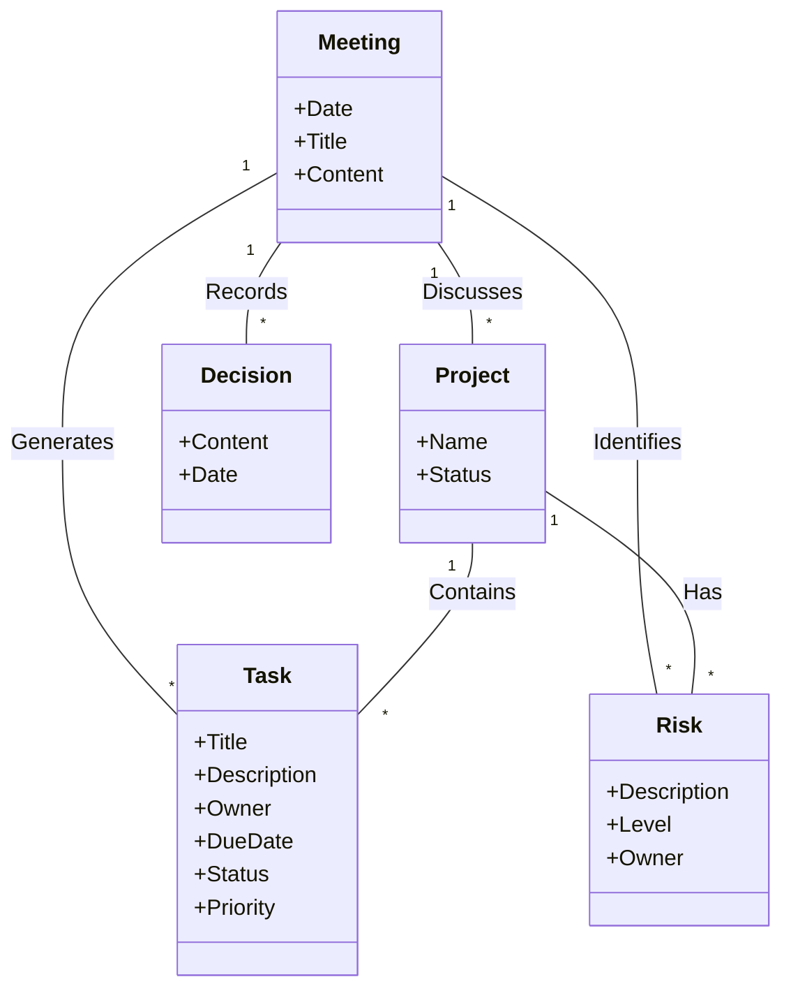

# 4. Data Model (Conceptual & Logical)

## 4.1. Domain Model (Conceptual)

## 4.2. Data Dictionary

| Data Item | Type | Description | Example |
|---|---|---|---|
| **meeting_id** | UUID | Unique identifier for a meeting. | `c7b3...` |
| **project_name** | String | Name of the project. | `Project Alpha` |
| **task_title** | String | Short summary of the task. | `Update API specs` |
| **due_date** | Date | Deadline for the task. | `2023-12-31` |
| **risk_level** | Enum | Severity of the risk (Low, Medium, High). | `High` |
| **source_sentence** | String | Original text from the meeting notes. | `We might miss the deadline if...` |
