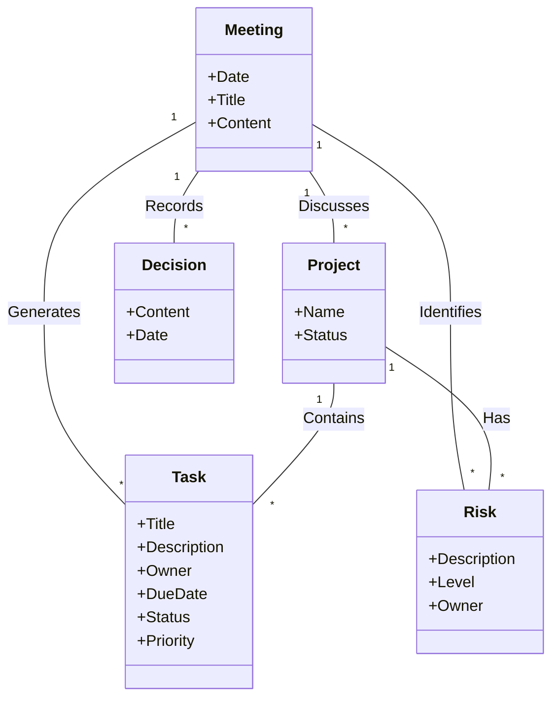

# 4. Data Model (Conceptual & Logical)

## 4.1. Domain Model (Conceptual)



---

## 4.2. Data Dictionary (Detailed)

### Overview

本データ定義書は、Project Progress DB システムで扱う全データ項目を一元管理する辞書である。

---

### Entity: Meeting（会議）

| Data Item | Logical Name | Type | Size | Required | Default | Description | Example |
|-----------|--------------|------|------|----------|---------|-------------|---------|
| meeting_id | 会議ID | STRING | 36 | Yes | UUID auto | 会議を一意に識別するUUID | `c7b3d8e1-...` |
| tenant_id | テナントID | STRING | 36 | Yes | - | マルチテナント用識別子 | `default` |
| meeting_date | 会議日 | DATE | - | Yes | - | 会議が開催された日付 | `2024-12-01` |
| title | 会議タイトル | STRING | 255 | No | null | 会議の件名 | `週次進捗会議` |
| source_file_uri | ソースファイルURI | STRING | 1024 | Yes | - | Cloud Storageの議事録ファイルパス | `gs://bucket/file.md` |
| language | 言語 | STRING | 10 | No | `ja` | 議事録の言語コード | `ja`, `en` |
| status | 処理ステータス | ENUM | - | Yes | `PENDING` | AI解析の処理状態 | `PENDING`, `DONE`, `ERROR` |
| created_at | 作成日時 | TIMESTAMP | - | Yes | CURRENT | レコード作成日時 | `2024-12-01T10:00:00Z` |

**Constraints:**
- `meeting_id`: PRIMARY KEY
- `status`: IN ('PENDING', 'PROCESSING', 'DONE', 'ERROR')

---

### Entity: Project（プロジェクト）

| Data Item | Logical Name | Type | Size | Required | Default | Description | Example |
|-----------|--------------|------|------|----------|---------|-------------|---------|
| project_id | プロジェクトID | STRING | 36 | Yes | UUID auto | プロジェクトを一意に識別するUUID | `a1b2c3d4-...` |
| tenant_id | テナントID | STRING | 36 | Yes | - | マルチテナント用識別子 | `default` |
| project_name | プロジェクト名 | STRING | 255 | Yes | - | プロジェクトの名称 | `システム刷新プロジェクト` |
| latest_meeting_id | 最新会議ID | STRING | 36 | No | null | 最後に議論された会議のID | `c7b3d8e1-...` |
| updated_at | 更新日時 | TIMESTAMP | - | Yes | CURRENT | 最終更新日時 | `2024-12-01T15:30:00Z` |

**Constraints:**
- `project_id`: PRIMARY KEY
- `latest_meeting_id`: FOREIGN KEY → meetings.meeting_id

---

### Entity: Task（タスク）

| Data Item | Logical Name | Type | Size | Required | Default | Description | Example |
|-----------|--------------|------|------|----------|---------|-------------|---------|
| task_id | タスクID | STRING | 36 | Yes | UUID auto | タスクを一意に識別するUUID | `t1a2b3c4-...` |
| meeting_id | 会議ID | STRING | 36 | Yes | - | タスクが抽出された会議のID | `c7b3d8e1-...` |
| project_id | プロジェクトID | STRING | 36 | Yes | - | タスクが属するプロジェクトのID | `a1b2c3d4-...` |
| task_title | タスク名 | STRING | 500 | Yes | - | タスクの概要・件名 | `API仕様書の作成` |
| task_description | タスク詳細 | STRING | 2000 | No | null | タスクの詳細説明 | `REST APIの...` |
| owner | 担当者 | STRING | 100 | No | null | タスクの担当者名 | `田中` |
| due_date | 期限日 | DATE | - | No | null | タスクの完了期限 | `2024-12-15` |
| status | ステータス | ENUM | - | Yes | `NOT_STARTED` | タスクの進捗状態 | `NOT_STARTED` |
| priority | 優先度 | ENUM | - | No | `MEDIUM` | タスクの優先度レベル | `HIGH` |
| source_sentence | 抽出元文 | STRING | 2000 | No | null | AIが抽出した元の文章 | `「12/15までに...」` |
| created_at | 作成日時 | TIMESTAMP | - | Yes | CURRENT | レコード作成日時 | `2024-12-01T10:00:00Z` |

**Constraints:**
- `task_id`: PRIMARY KEY
- `meeting_id`: FOREIGN KEY → meetings.meeting_id
- `project_id`: FOREIGN KEY → projects.project_id
- `status`: IN ('NOT_STARTED', 'IN_PROGRESS', 'DONE', 'BLOCKED')
- `priority`: IN ('LOW', 'MEDIUM', 'HIGH')

---

### Entity: Risk（リスク）

| Data Item | Logical Name | Type | Size | Required | Default | Description | Example |
|-----------|--------------|------|------|----------|---------|-------------|---------|
| risk_id | リスクID | STRING | 36 | Yes | UUID auto | リスクを一意に識別するUUID | `r1a2b3c4-...` |
| meeting_id | 会議ID | STRING | 36 | Yes | - | リスクが識別された会議のID | `c7b3d8e1-...` |
| project_id | プロジェクトID | STRING | 36 | Yes | - | リスクが関連するプロジェクトのID | `a1b2c3d4-...` |
| risk_description | リスク説明 | STRING | 2000 | Yes | - | リスクの内容・説明 | `外部API仕様変更の可能性` |
| risk_level | リスクレベル | ENUM | - | Yes | - | リスクの深刻度 | `HIGH` |
| owner | 担当者 | STRING | 100 | No | null | リスク対応の担当者 | `佐藤` |
| source_sentence | 抽出元文 | STRING | 2000 | No | null | AIが抽出した元の文章 | `「期限に間に合わない...」` |
| created_at | 作成日時 | TIMESTAMP | - | Yes | CURRENT | レコード作成日時 | `2024-12-01T10:00:00Z` |

**Constraints:**
- `risk_id`: PRIMARY KEY
- `meeting_id`: FOREIGN KEY → meetings.meeting_id
- `project_id`: FOREIGN KEY → projects.project_id
- `risk_level`: IN ('LOW', 'MEDIUM', 'HIGH')

---

### Entity: Decision（決定事項）

| Data Item | Logical Name | Type | Size | Required | Default | Description | Example |
|-----------|--------------|------|------|----------|---------|-------------|---------|
| decision_id | 決定ID | STRING | 36 | Yes | UUID auto | 決定事項を一意に識別するUUID | `d1a2b3c4-...` |
| meeting_id | 会議ID | STRING | 36 | Yes | - | 決定が行われた会議のID | `c7b3d8e1-...` |
| project_id | プロジェクトID | STRING | 36 | Yes | - | 決定が関連するプロジェクトのID | `a1b2c3d4-...` |
| decision_content | 決定内容 | STRING | 2000 | Yes | - | 決定事項の内容 | `週次会議は月曜10時に開催` |
| source_sentence | 抽出元文 | STRING | 2000 | No | null | AIが抽出した元の文章 | `「毎週月曜に...」` |
| created_at | 作成日時 | TIMESTAMP | - | Yes | CURRENT | レコード作成日時 | `2024-12-01T10:00:00Z` |

**Constraints:**
- `decision_id`: PRIMARY KEY
- `meeting_id`: FOREIGN KEY → meetings.meeting_id
- `project_id`: FOREIGN KEY → projects.project_id

---

### Enumeration Values

#### status (Meeting)

| Value | Logical Name | Description |
|-------|--------------|-------------|
| PENDING | 待機中 | ファイルアップロード完了、AI処理待ち |
| PROCESSING | 処理中 | AI解析実行中 |
| DONE | 完了 | AI解析正常完了 |
| ERROR | エラー | AI解析失敗 |

#### status (Task)

| Value | Logical Name | Description |
|-------|--------------|-------------|
| NOT_STARTED | 未着手 | タスク未開始 |
| IN_PROGRESS | 進行中 | タスク作業中 |
| DONE | 完了 | タスク完了 |
| BLOCKED | ブロック | 問題により停止中 |

#### priority (Task)

| Value | Logical Name | Description |
|-------|--------------|-------------|
| LOW | 低 | 優先度低 |
| MEDIUM | 中 | 優先度中（デフォルト） |
| HIGH | 高 | 優先度高 |

#### risk_level (Risk)

| Value | Logical Name | Description |
|-------|--------------|-------------|
| LOW | 低 | 影響が軽微 |
| MEDIUM | 中 | 一定の影響あり |
| HIGH | 高 | 重大な影響の可能性 |

---

### Cross-Reference: Entity Relationships

```
meetings ─┬── 1:N ──► tasks
          ├── 1:N ──► risks
          ├── 1:N ──► decisions
          └── N:1 ◄── projects.latest_meeting_id

projects ─┬── 1:N ──► tasks
          └── 1:N ──► risks

tenant_id: 全エンティティで共通のマルチテナント識別子
```
