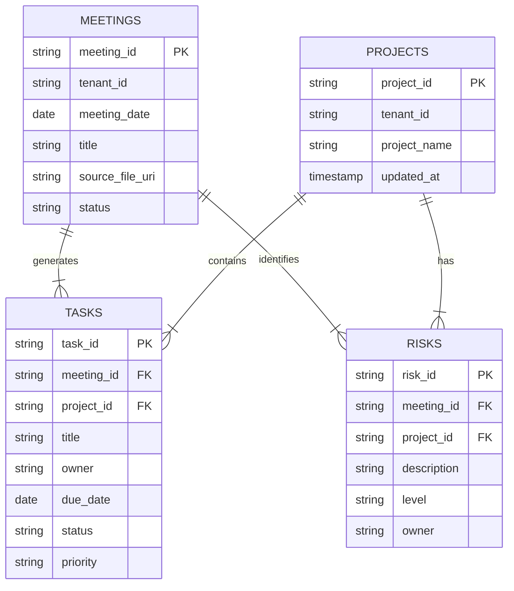

# 5. Database Design (Physical)

## 5.1. ER Diagram

## 5.2. Table Definitions (BigQuery)

### `meetings`
| Column | Type | Nullable | Description |
|---|---|---|---|
| `meeting_id` | STRING | No | Primary Key (UUID) |
| `tenant_id` | STRING | No | Tenant Identifier |
| `meeting_date` | DATE | No | Date of the meeting |
| `title` | STRING | Yes | Meeting title |
| `source_file_uri` | STRING | No | GCS URI of the uploaded file |
| `status` | STRING | No | Processing status (PENDING, DONE, ERROR) |
| `created_at` | TIMESTAMP | No | Record creation time |

### `projects`
| Column | Type | Nullable | Description |
|---|---|---|---|
| `project_id` | STRING | No | Primary Key (UUID) |
| `tenant_id` | STRING | No | Tenant Identifier |
| `project_name` | STRING | No | Name of the project |
| `latest_meeting_id` | STRING | Yes | ID of the last meeting discussing this project |
| `updated_at` | TIMESTAMP | No | Last update time |

### `tasks`
| Column | Type | Nullable | Description |
|---|---|---|---|
| `task_id` | STRING | No | Primary Key (UUID) |
| `meeting_id` | STRING | No | Foreign Key to Meetings |
| `project_id` | STRING | No | Foreign Key to Projects |
| `task_title` | STRING | No | Task summary |
| `owner` | STRING | Yes | Person responsible |
| `due_date` | DATE | Yes | Deadline |
| `status` | STRING | No | NOT_STARTED, IN_PROGRESS, DONE |
| `priority` | STRING | Yes | LOW, MEDIUM, HIGH |

### `risks`
| Column | Type | Nullable | Description |
|---|---|---|---|
| `risk_id` | STRING | No | Primary Key (UUID) |
| `meeting_id` | STRING | No | Foreign Key to Meetings |
| `project_id` | STRING | No | Foreign Key to Projects |
| `risk_description` | STRING | No | Description of the risk |
| `risk_level` | STRING | No | LOW, MEDIUM, HIGH |
| `owner` | STRING | Yes | Person responsible |
