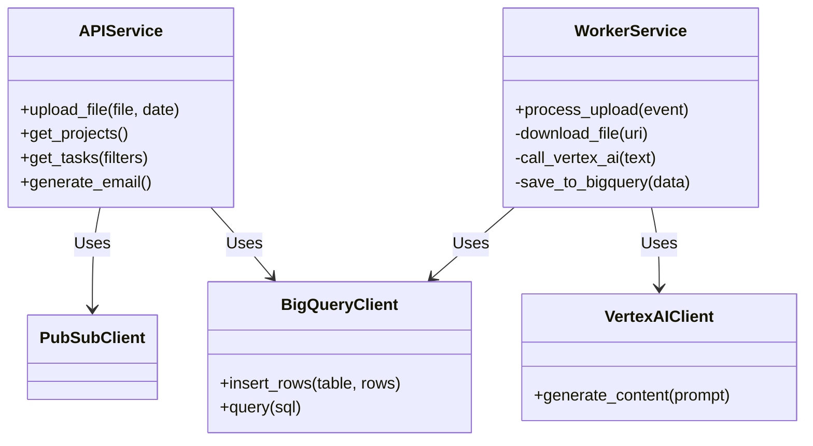
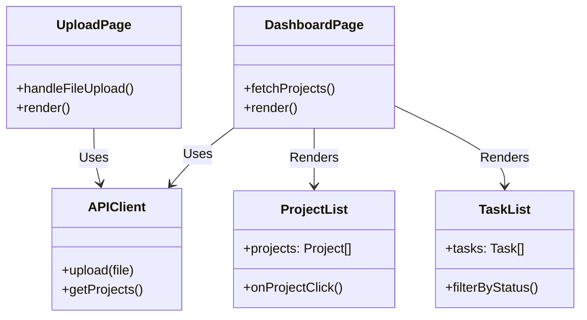

# 6. Object Design (Static Structure)

## 6.1. Class Diagram (Backend Services)

```mermaid
classDiagram
    class APIService {
        +upload_file(file, date)
        +get_projects()
        +get_tasks(filters)
        +generate_email()
    }

    class WorkerService {
        +process_upload(event)
        -download_file(uri)
        -call_vertex_ai(text)
        -save_to_bigquery(data)
    }

    class VertexAIClient {
        +generate_content(prompt)
    }

    class BigQueryClient {
        +insert_rows(table, rows)
        +query(sql)
    }

    APIService --> BigQueryClient : Uses
    APIService --> PubSubClient : Uses
    WorkerService --> VertexAIClient : Uses
    WorkerService --> BigQueryClient : Uses
```

## 6.2. Class Diagram (Frontend Components)

```mermaid
classDiagram
    class UploadPage {
        +handleFileUpload()
        +render()
    }

    class DashboardPage {
        +fetchProjects()
        +render()
    }

    class ProjectList {
        +projects: Project[]
        +onProjectClick()
    }

    class TaskList {
        +tasks: Task[]
        +filterByStatus()
    }

    class APIClient {
        +upload(file)
        +getProjects()
    }

    UploadPage --> APIClient : Uses
    DashboardPage --> APIClient : Uses
    DashboardPage --> ProjectList : Renders
    DashboardPage --> TaskList : Renders
```
