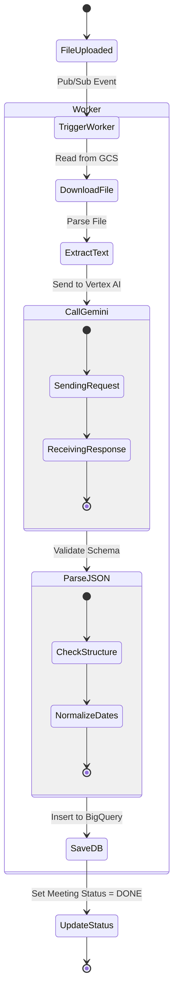

# 7. Process & Flow Definitions

## 7.1. User Flow Diagram

```mermaid
graph TD
    Start[Start] --> Login[Login via Google]
    Login --> Dashboard[Dashboard]
    
    Dashboard -->|Upload New| Upload[Upload Page]
    Upload -->|Select File| FileSelected[File Selected]
    FileSelected -->|Confirm| Processing[Processing (Async)]
    Processing --> Dashboard
    
    Dashboard -->|View Project| ProjectDetail[Project Detail]
    ProjectDetail -->|Filter Tasks| FilteredTasks[Filtered Task List]
    
    Dashboard -->|Generate Report| Report[Report Page]
    Report -->|Copy Text| End[End]
```

## 7.2. Activity Diagram (Analysis Process)


