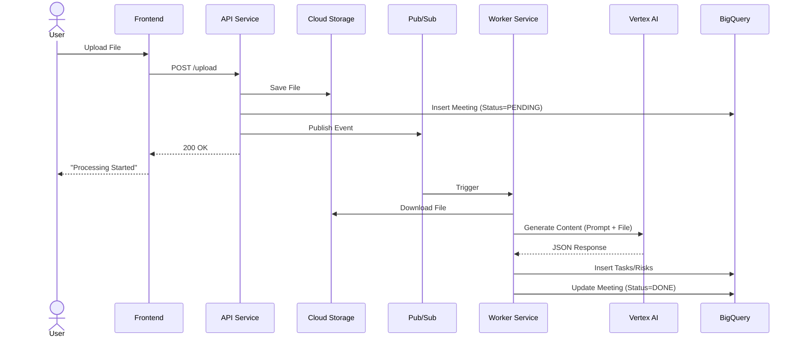
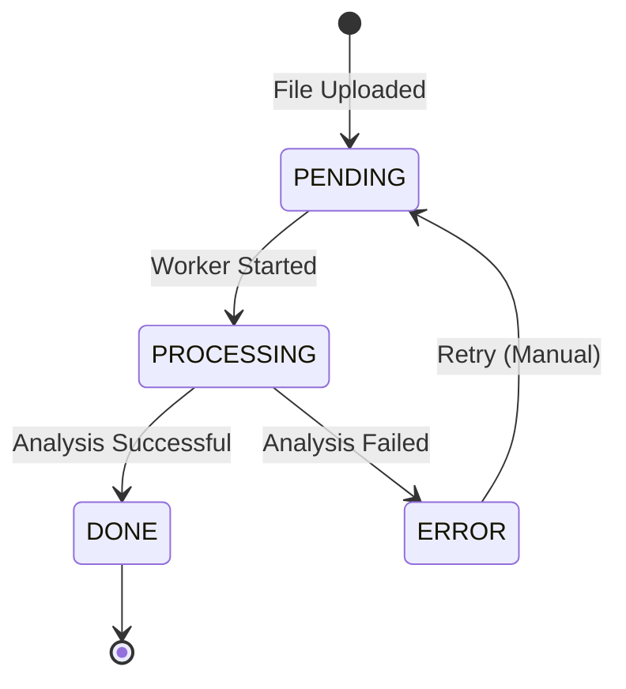
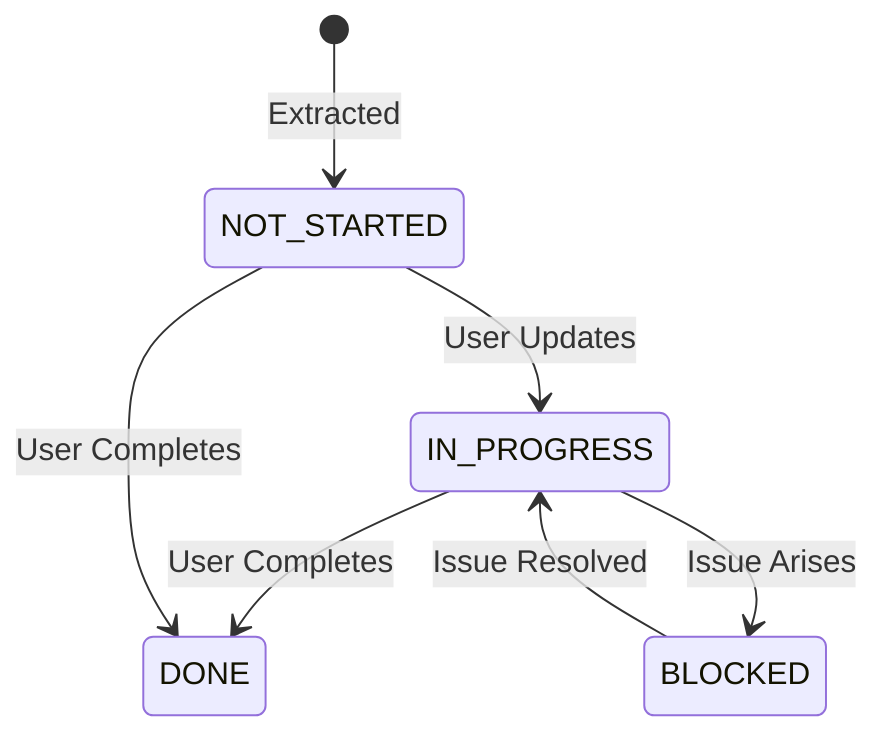

# 8. Object Design (Dynamic Behavior)

## 8.1. Sequence Diagram (Upload & Analysis)

```mermaid
sequenceDiagram
    actor User
    participant UI as Frontend
    participant API as API Service
    participant GCS as Cloud Storage
    participant PS as Pub/Sub
    participant Worker as Worker Service
    participant AI as Vertex AI
    participant BQ as BigQuery

    User->>UI: Upload File
    UI->>API: POST /upload
    API->>GCS: Save File
    API->>BQ: Insert Meeting (Status=PENDING)
    API->>PS: Publish Event
    API-->>UI: 200 OK
    UI-->>User: "Processing Started"

    PS->>Worker: Trigger
    Worker->>GCS: Download File
    Worker->>AI: Generate Content (Prompt + File)
    AI-->>Worker: JSON Response
    Worker->>BQ: Insert Tasks/Risks
    Worker->>BQ: Update Meeting (Status=DONE)
```

## 8.2. State Machine Diagram (Meeting Status)

```mermaid
stateDiagram-v2
    [*] --> PENDING : File Uploaded
    PENDING --> PROCESSING : Worker Started
    PROCESSING --> DONE : Analysis Successful
    PROCESSING --> ERROR : Analysis Failed
    
    DONE --> [*]
    ERROR --> PENDING : Retry (Manual)
```

## 8.3. State Machine Diagram (Task Status)

```mermaid
stateDiagram-v2
    [*] --> NOT_STARTED : Extracted
    NOT_STARTED --> IN_PROGRESS : User Updates
    IN_PROGRESS --> DONE : User Completes
    NOT_STARTED --> DONE : User Completes
    
    IN_PROGRESS --> BLOCKED : Issue Arises
    BLOCKED --> IN_PROGRESS : Issue Resolved
```
