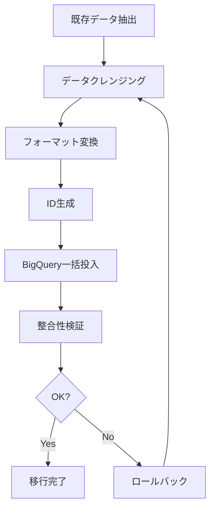

# 11. 本番データ化処理仕様書（データ移行計画）

## 11.1. 概要

本仕様書は、Project Progress DB システムの初期セットアップおよびデータ移行に関する手順と仕様を定義する。

### 対象

- 新規環境へのシステムデプロイ時の初期データ投入
- 既存データからの移行（将来対応）
- マスタデータの初期設定

---

## 11.2. インフラ初期化処理

### Terraform による環境構築

```bash
# 1. GCPプロジェクトの初期化
cd terraform
terraform init

# 2. 変数の設定
cp terraform.tfvars.example terraform.tfvars
# terraform.tfvars を編集

# 3. プラン確認
terraform plan

# 4. リソース作成
terraform apply
```

### 作成されるリソース

| リソース | 説明 | Terraformファイル |
|----------|------|-------------------|
| BigQueryデータセット | `project_progress` データセット | `bigquery.tf` |
| BigQueryテーブル | meetings, projects, tasks, risks, decisions | `bigquery.tf` |
| Cloud Storageバケット | 会議議事録ファイル保存用 | `storage.tf` |
| Pub/Subトピック | `meeting-uploaded` イベント用 | `pubsub.tf` |
| Pub/Subサブスクリプション | Worker用Push subscription | `pubsub.tf` |
| Cloud Run サービス | Frontend, API, Worker | `cloudrun.tf` |
| Secret Manager | JWT秘密鍵、OAuthクレデンシャル | `secrets.tf` |
| IAMロール | サービスアカウント権限 | `iam.tf` |
| Artifact Registry | Dockerイメージリポジトリ | `artifact_registry.tf` |

---

## 11.3. 初期データ投入

### 11.3.1. BigQuery テーブル初期化

Terraformで自動作成されるテーブルスキーマ:

#### meetings テーブル

```sql
CREATE TABLE IF NOT EXISTS `{project}.project_progress.meetings` (
  meeting_id STRING NOT NULL,
  tenant_id STRING NOT NULL,
  meeting_date DATE NOT NULL,
  title STRING,
  source_file_uri STRING NOT NULL,
  language STRING DEFAULT 'ja',
  status STRING NOT NULL,  -- PENDING, DONE, ERROR
  created_at TIMESTAMP NOT NULL
);
```

#### projects テーブル

```sql
CREATE TABLE IF NOT EXISTS `{project}.project_progress.projects` (
  project_id STRING NOT NULL,
  tenant_id STRING NOT NULL,
  project_name STRING NOT NULL,
  latest_meeting_id STRING,
  updated_at TIMESTAMP NOT NULL
);
```

#### tasks テーブル

```sql
CREATE TABLE IF NOT EXISTS `{project}.project_progress.tasks` (
  task_id STRING NOT NULL,
  meeting_id STRING NOT NULL,
  project_id STRING NOT NULL,
  task_title STRING NOT NULL,
  owner STRING,
  due_date DATE,
  status STRING NOT NULL,  -- NOT_STARTED, IN_PROGRESS, DONE
  priority STRING,  -- LOW, MEDIUM, HIGH
  source_sentence STRING,
  created_at TIMESTAMP NOT NULL
);
```

#### risks テーブル

```sql
CREATE TABLE IF NOT EXISTS `{project}.project_progress.risks` (
  risk_id STRING NOT NULL,
  meeting_id STRING NOT NULL,
  project_id STRING NOT NULL,
  risk_description STRING NOT NULL,
  risk_level STRING NOT NULL,  -- LOW, MEDIUM, HIGH
  owner STRING,
  source_sentence STRING,
  created_at TIMESTAMP NOT NULL
);
```

#### decisions テーブル

```sql
CREATE TABLE IF NOT EXISTS `{project}.project_progress.decisions` (
  decision_id STRING NOT NULL,
  meeting_id STRING NOT NULL,
  project_id STRING NOT NULL,
  decision_content STRING NOT NULL,
  source_sentence STRING,
  created_at TIMESTAMP NOT NULL
);
```

### 11.3.2. 環境変数・シークレット設定

#### Secret Manager への登録

```bash
# JWT秘密鍵の生成と登録
openssl rand -base64 32 > jwt_secret.txt
gcloud secrets create jwt-secret-key --data-file=jwt_secret.txt

# Google OAuth クレデンシャルの登録
gcloud secrets create google-oauth-client-id --data-file=client_id.txt
gcloud secrets create google-oauth-client-secret --data-file=client_secret.txt
```

#### 必要な環境変数

| 変数名 | 説明 | 設定場所 |
|--------|------|----------|
| `GCP_PROJECT_ID` | GCPプロジェクトID | Cloud Run |
| `BIGQUERY_DATASET` | BigQueryデータセット名 | Cloud Run |
| `GCS_BUCKET` | Cloud Storageバケット名 | Cloud Run |
| `PUBSUB_TOPIC` | Pub/Subトピック名 | Cloud Run |
| `JWT_SECRET_KEY` | JWT署名用秘密鍵 | Secret Manager参照 |
| `GOOGLE_CLIENT_ID` | OAuth Client ID | Secret Manager参照 |
| `GOOGLE_CLIENT_SECRET` | OAuth Client Secret | Secret Manager参照 |
| `FRONTEND_URL` | フロントエンドURL | Cloud Run |

---

## 11.4. サンプルデータ投入（開発・テスト用）

### 11.4.1. サンプル会議議事録

開発環境では、以下のサンプルデータを使用してシステム動作を確認する。

```markdown
# サンプル会議議事録

日時: 2024-12-01
参加者: 田中、佐藤、鈴木

## プロジェクト: システム刷新プロジェクト

### 進捗報告
- 基本設計が完了
- 詳細設計を来週金曜日までに完了予定（担当: 田中）

### タスク
- [ ] API仕様書の作成（担当: 佐藤、期限: 12/10）
- [ ] テスト計画書の作成（担当: 鈴木、期限: 12/15）

### リスク
- 外部APIの仕様変更の可能性あり（レベル: 中）
- テスト環境の準備が遅れている（レベル: 高）

### 決定事項
- 週次進捗会議は毎週月曜10時に開催
- コードレビューは2名以上で実施
```

### 11.4.2. サンプルデータ投入スクリプト

```python
# scripts/seed_data.py
from google.cloud import bigquery
from datetime import datetime
import uuid

client = bigquery.Client()
dataset = "project_progress"

# サンプルプロジェクト
projects = [
    {
        "project_id": str(uuid.uuid4()),
        "tenant_id": "default",
        "project_name": "システム刷新プロジェクト",
        "updated_at": datetime.now()
    },
    {
        "project_id": str(uuid.uuid4()),
        "tenant_id": "default",
        "project_name": "新機能開発",
        "updated_at": datetime.now()
    }
]

# 投入
errors = client.insert_rows_json(f"{dataset}.projects", projects)
if errors:
    print(f"Errors: {errors}")
else:
    print("Projects inserted successfully")
```

---

## 11.5. 既存データ移行（将来対応）

### 11.5.1. 移行対象データ

| ソース | データ種別 | 移行先テーブル |
|--------|-----------|---------------|
| Excel/CSV | タスク一覧 | tasks |
| スプレッドシート | プロジェクト情報 | projects |
| 既存DB | 過去の会議記録 | meetings |

### 11.5.2. 移行フロー



### 11.5.3. 移行バッチ処理仕様

#### CSV → BigQuery 移行スクリプト

```python
# scripts/migrate_csv.py
import csv
import uuid
from google.cloud import bigquery
from datetime import datetime

def migrate_tasks_from_csv(csv_path: str, project_id: str, meeting_id: str):
    """
    CSVファイルからタスクデータを移行

    CSV形式:
    タスク名,担当者,期限,ステータス,優先度
    """
    client = bigquery.Client()

    tasks = []
    with open(csv_path, 'r', encoding='utf-8') as f:
        reader = csv.DictReader(f)
        for row in reader:
            task = {
                "task_id": str(uuid.uuid4()),
                "meeting_id": meeting_id,
                "project_id": project_id,
                "task_title": row['タスク名'],
                "owner": row.get('担当者'),
                "due_date": row.get('期限'),  # YYYY-MM-DD形式
                "status": map_status(row.get('ステータス', 'NOT_STARTED')),
                "priority": map_priority(row.get('優先度', 'MEDIUM')),
                "created_at": datetime.now().isoformat()
            }
            tasks.append(task)

    # バルクインサート
    errors = client.insert_rows_json("project_progress.tasks", tasks)
    return errors

def map_status(status_ja: str) -> str:
    mapping = {
        "未着手": "NOT_STARTED",
        "進行中": "IN_PROGRESS",
        "完了": "DONE"
    }
    return mapping.get(status_ja, "NOT_STARTED")

def map_priority(priority_ja: str) -> str:
    mapping = {
        "低": "LOW",
        "中": "MEDIUM",
        "高": "HIGH"
    }
    return mapping.get(priority_ja, "MEDIUM")
```

---

## 11.6. ロールバック手順

### 11.6.1. データロールバック

```bash
# BigQueryテーブルのバックアップからリストア
bq cp project_progress.tasks@-3600000 project_progress.tasks

# 特定時点のスナップショットからリストア（タイムトラベル）
SELECT * FROM `project_progress.tasks`
FOR SYSTEM_TIME AS OF TIMESTAMP_SUB(CURRENT_TIMESTAMP(), INTERVAL 1 HOUR)
```

### 11.6.2. インフラロールバック

```bash
# Terraform によるロールバック
cd terraform
git checkout HEAD~1 -- .
terraform apply

# Cloud Run リビジョンのロールバック
gcloud run services update-traffic project-progress-api \
  --to-revisions=REVISION_NAME=100
```

---

## 11.7. 検証チェックリスト

### 初期セットアップ検証

| # | 確認項目 | 確認方法 | OK |
|---|----------|----------|-----|
| 1 | BigQueryテーブル作成 | `bq ls project_progress` | [ ] |
| 2 | Cloud Storageバケット作成 | `gsutil ls` | [ ] |
| 3 | Pub/Subトピック作成 | `gcloud pubsub topics list` | [ ] |
| 4 | Cloud Runサービス起動 | ヘルスチェックURL確認 | [ ] |
| 5 | Secret Manager設定 | `gcloud secrets list` | [ ] |
| 6 | IAM権限設定 | サービスアカウント権限確認 | [ ] |

### データ投入検証

| # | 確認項目 | 確認方法 | OK |
|---|----------|----------|-----|
| 1 | テーブルスキーマ | BQコンソールで確認 | [ ] |
| 2 | データ件数 | `SELECT COUNT(*) FROM ...` | [ ] |
| 3 | データ整合性 | FK参照先存在確認 | [ ] |
| 4 | 重複チェック | PK重複なし確認 | [ ] |
| 5 | 必須項目チェック | NULL値確認 | [ ] |

### E2E動作検証

| # | 確認項目 | 確認方法 | OK |
|---|----------|----------|-----|
| 1 | ログイン可能 | Google OAuth | [ ] |
| 2 | ファイルアップロード | テストファイル投入 | [ ] |
| 3 | AI解析完了 | ステータスDONE確認 | [ ] |
| 4 | ダッシュボード表示 | データ表示確認 | [ ] |
| 5 | CSVエクスポート | ファイルダウンロード | [ ] |

---

## 11.8. 運用時のデータメンテナンス

### 定期バックアップ

```bash
# BigQuery テーブルのエクスポート（日次）
bq extract --destination_format=NEWLINE_DELIMITED_JSON \
  project_progress.tasks \
  gs://backup-bucket/tasks/tasks_$(date +%Y%m%d).json
```

### データクリーンアップ

```sql
-- 1年以上前の処理済み会議データをアーカイブテーブルへ移動
INSERT INTO `project_progress.meetings_archive`
SELECT * FROM `project_progress.meetings`
WHERE created_at < TIMESTAMP_SUB(CURRENT_TIMESTAMP(), INTERVAL 365 DAY)
  AND status = 'DONE';

-- 元テーブルから削除
DELETE FROM `project_progress.meetings`
WHERE created_at < TIMESTAMP_SUB(CURRENT_TIMESTAMP(), INTERVAL 365 DAY)
  AND status = 'DONE';
```

### 統計情報更新

```sql
-- プロジェクトごとのサマリ更新（日次バッチ）
CREATE OR REPLACE TABLE `project_progress.project_summary` AS
SELECT
  p.project_id,
  p.project_name,
  COUNT(DISTINCT t.task_id) AS total_tasks,
  COUNT(DISTINCT CASE WHEN t.status = 'DONE' THEN t.task_id END) AS completed_tasks,
  COUNT(DISTINCT CASE WHEN t.due_date < CURRENT_DATE() AND t.status != 'DONE' THEN t.task_id END) AS overdue_tasks,
  COUNT(DISTINCT r.risk_id) AS total_risks,
  COUNT(DISTINCT CASE WHEN r.risk_level = 'HIGH' THEN r.risk_id END) AS high_risks
FROM `project_progress.projects` p
LEFT JOIN `project_progress.tasks` t ON p.project_id = t.project_id
LEFT JOIN `project_progress.risks` r ON p.project_id = r.project_id
GROUP BY p.project_id, p.project_name;
```
